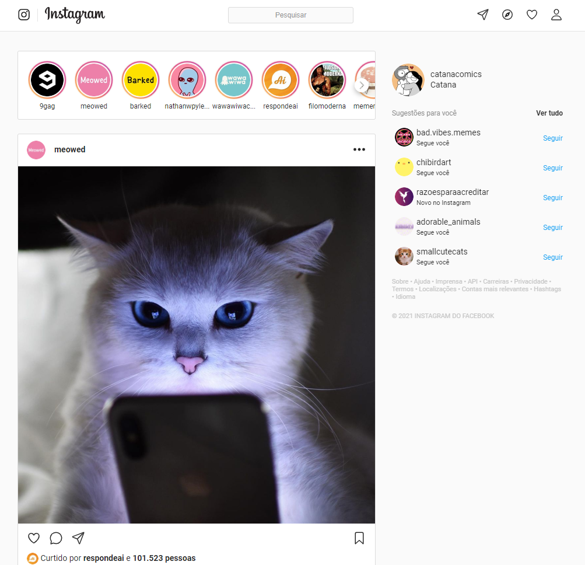

# Instagram

### Aplicar o layout responsivo da versão web do Instagram, utilizando HTML e CSS
 
### Realizado por Gabriel Neves no Curso de Desenvolvimento Web Full-Stack da Driven Education

### Site disponivel em: https://neves-gabriel.github.io/Instagram/

#### Preview do projeto:

